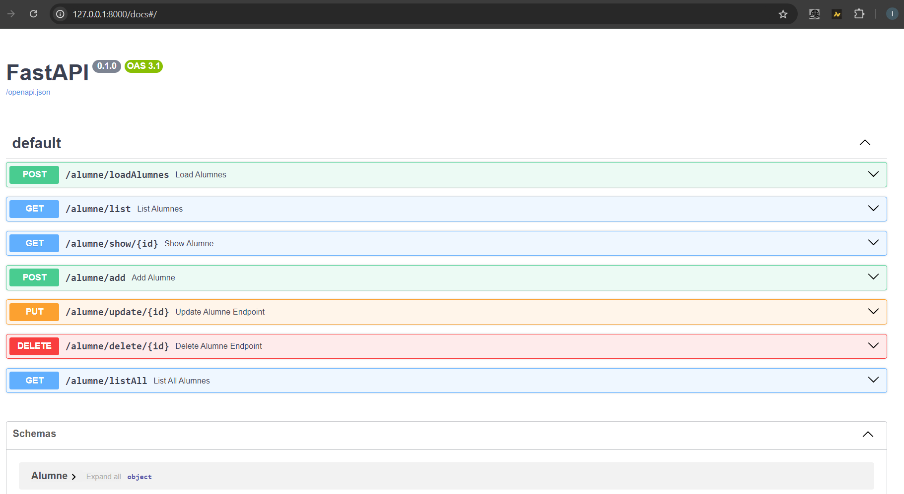
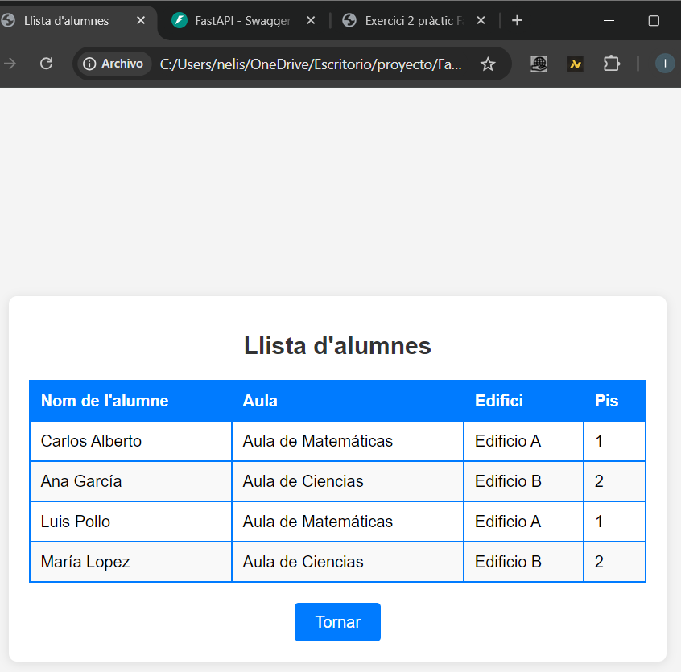
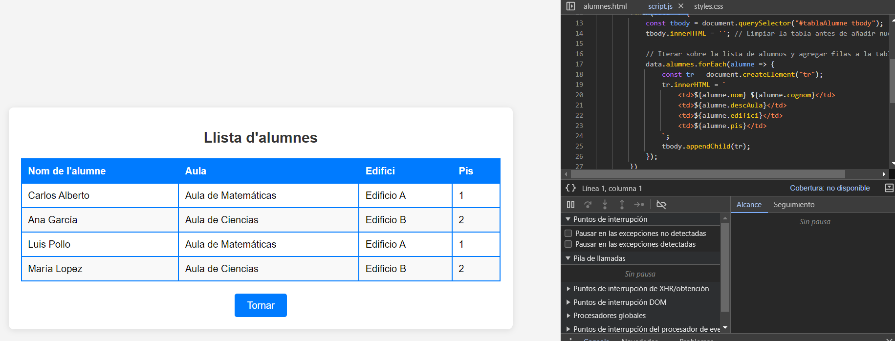
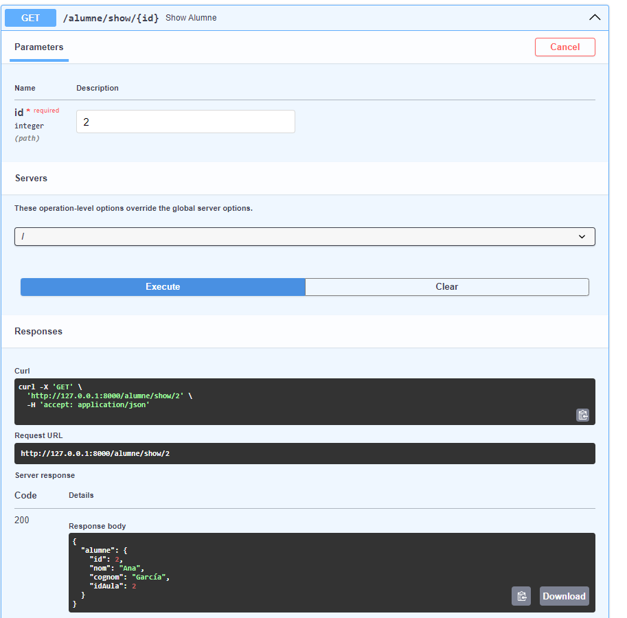
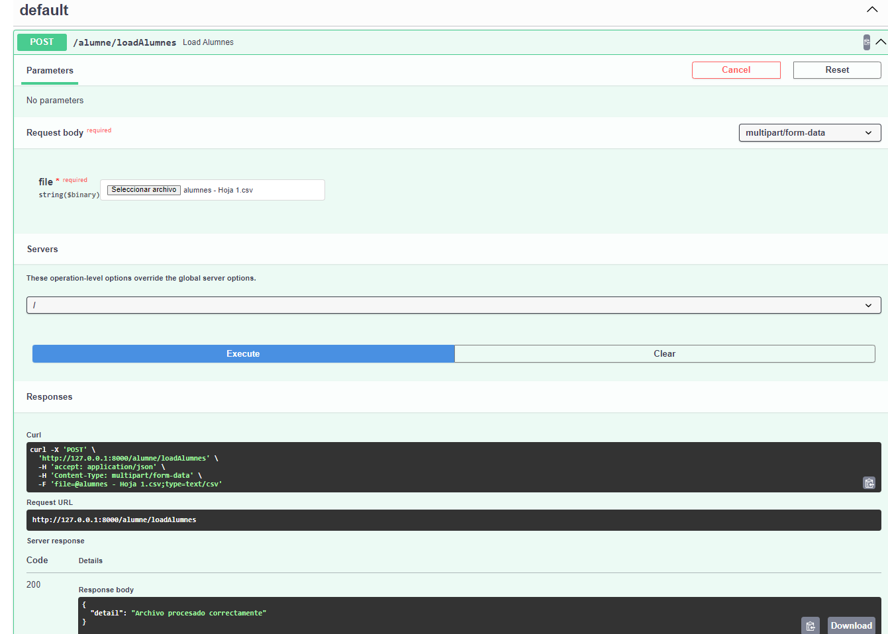
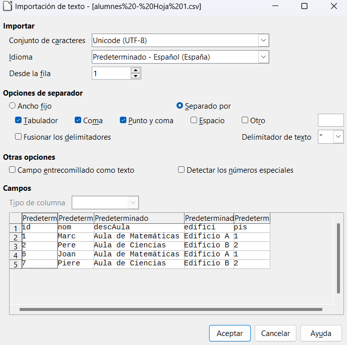
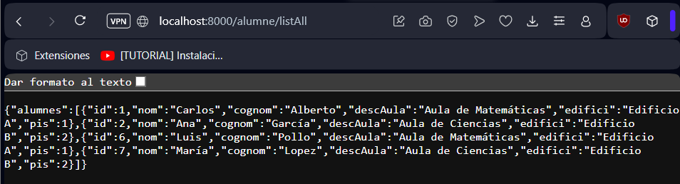
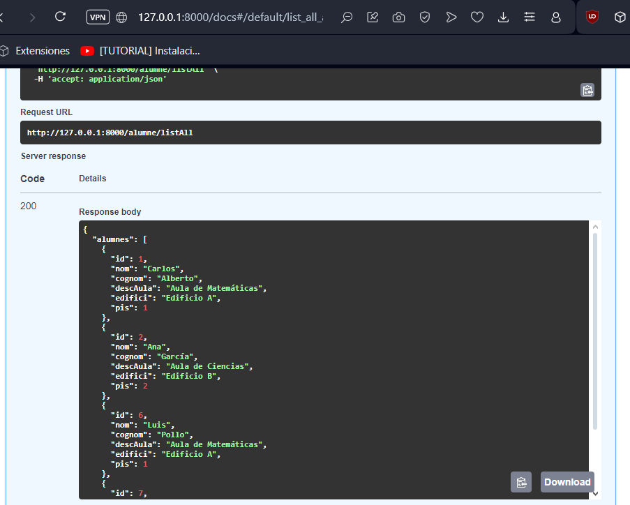
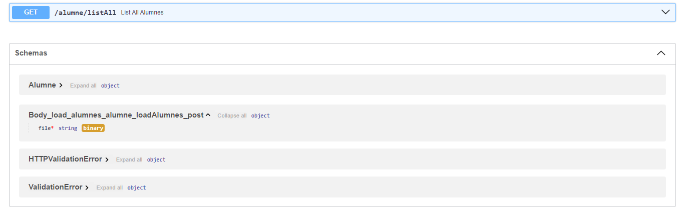

# Luis Montiel

## Segunda práctica hecha con FastAPI
Hemos implementado una connexion de js y html con FastAPI para gestionar una lista de alumnos en frontend.

# Exercici 1: Crida de l’API des de la web
@app.get("/alumne/listAll")
async def get_alumnes():
    """Retorna la lista de alumnos."""
    return db.get_all_alumnes()  # Devuelve todos los registros de alumnos.

# Exercici 2: Consultas Avanzadas
@app.get("/alumnes/{id}")
async def get_alumne(id: int):
    """Retorna un alumno específico según su ID."""
    return db.get_alumne_by_id(id)  # Obtiene un alumno por su ID.

# Exercici 3: Carga masiva d’alumnes
@app.post("/cargar_alumnes")
async def cargar_alumnes(file: UploadFile = File(...)):
    """Carga alumnos desde un archivo CSV."""
    df = pd.read_csv(file.file)
    db.insert_multiple_alumnes(df.to_dict(orient='records'))  # Procesa el CSV y lo inserta en la DB.

# Configuración de CORS
from fastapi.middleware.cors import CORSMiddleware

app.add_middleware(
    CORSMiddleware,
    allow_origins=["*"],  # Permitir cualquier origen
    allow_credentials=True,
    allow_methods=["*"],
    allow_headers=["*"],
)

# Comentario sobre el fetch
# Utiliza fetch para llamar al endpoint de alumnos, procesando la respuesta en JSON.

# Cambios en consultas
# Mejora en la consulta SQL para eficiencia: 
# SELECT NomAlumne, Cicle, Curs, Grup, DescAula FROM Alumne.

# alumne.py
def alumne_schema(fetchAlumnes):
    # Transforma los datos de un alumno a un diccionario.
    return {
        "NomAlumne": fetchAlumnes[0],
        "Cicle": fetchAlumnes[1],
        "Curs": fetchAlumnes[2],
        "Grup": fetchAlumnes[3],
        "DescAula": fetchAlumnes[4]
    }

# Cambios en main.py
@app.get("/alumnes/list", response_model=List[tablaAlumne])
def read_alumnes():
    # Lee todos los alumnos y devuelve en formato tablaAlumne.
    ...

# Definición de tablaAlumne
class tablaAlumne(BaseModel):
    NomAlumne: str
    Cicle: str
    Curs: str
    Grup: str
    DescAula: str

# Implementación de query parameters
@app.get("/alumnes/list", response_model=List[tablaAlumne])
def read_alumnes(orderby: str | None = None, contain: str | None = None,
                 skip: int = 0, limit: int | None = None):
    # Acepta parámetros para búsquedas complejas.
    ...

# Capturas de Pantalla de las Pruebas
# 1. Crida de l’API des de la web 

# 2. Consultas Avanzadas

# 3. Carga masiva d’alumnes

