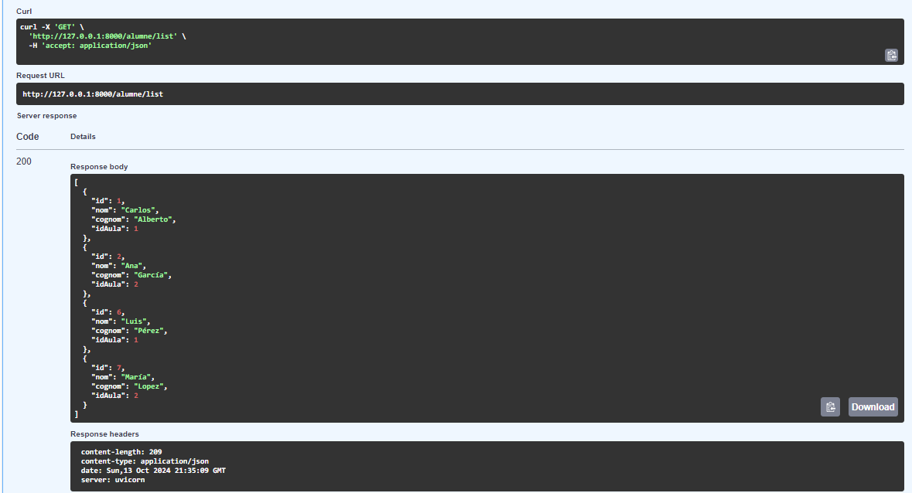
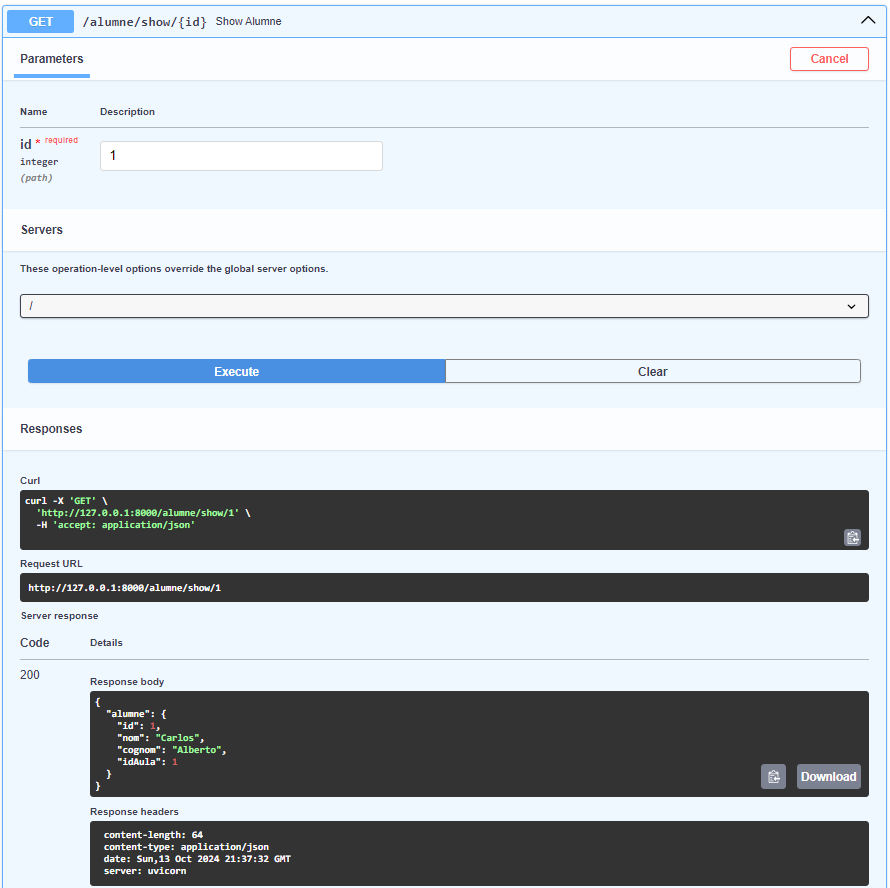
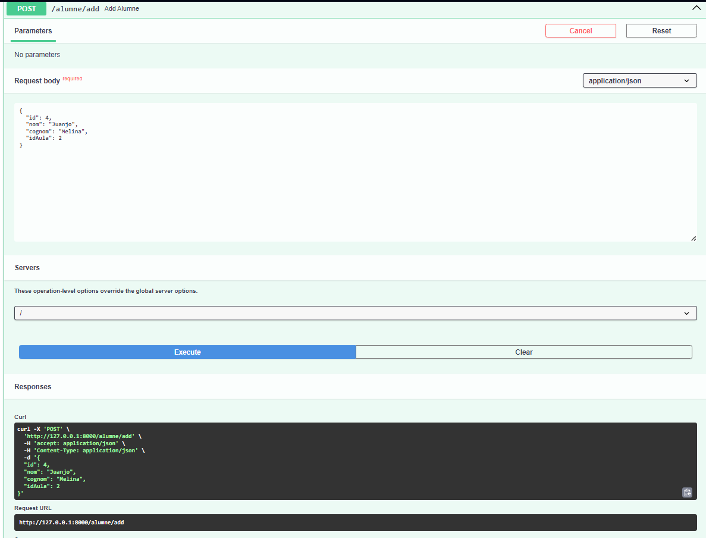
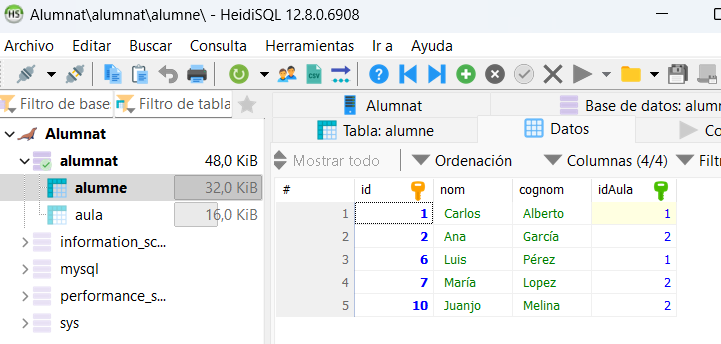
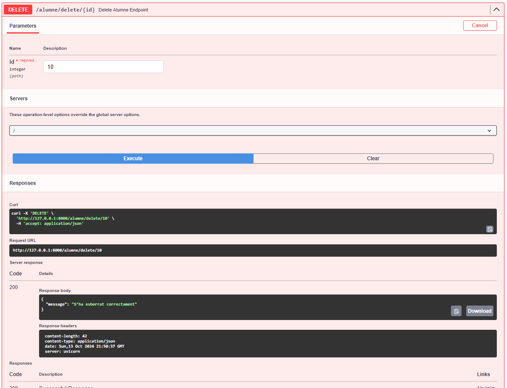

# Luis Montiel

## Primera practica feta FastaAPi. 

Aquesta API permet que he fet  gestiona alumnes i les seves aules utilitzant FastAPI i una base de dades libmariadb.dll. L'objectiu és proporcionar funcionalitats de CRUD (Crear, Llegir, Actualitzar, Esborrar) per als alumnes.

# Exercici 1 pràctic FastAPI

1. *Configuració de FastAPI e Uvicorn*
    He instal·lat les dependències necessaries, incloent FastAPI, uvicorn i mysql-connector-python per a la connexió amb la base de dades. He configurat la connexió a la base de dades amb la funció db_client.

2. *Definició del la tabla Alumne Heidi SQL*
    Hem creat un model Alumne utilitzant Pydantic per a la validació de dades. Aquest model inclou els camps id, nom, cognom, i idAula.

    ```
    python
    class Alumne(BaseModel):
        id: int
        nom: str
        cognom: str
        idAula: int

    ```

3. *Endpoints De la Pratica *:
Hem definit diversos endpoints per a l'API:
    *GET /alumne/list**: Retorna una llista de tots els alumnes.
    *GET /alumne/show/{id}**: Retorna la informació d'un alumne específic.
    *POST /alumne/add**: Afegeix un nou alumne, validant l'`idAula`.
    *PUT /alumne/update/{id}**: Actualitza un alumne existent.
    *DELETE /alumne/delete/{id}**: Elimina un alumne.
    *GET /alumne/listAll**: Retorna alumnes amb informació de les seves aules.

4. **Funcions que hem implementat a la Base de Dades**:
He creat funcions per gestionar base de dades en el fitxer alumne_db.py, per conectar els endpoints:
    read_alumnes
    create_alumne
    update_alumne
    delete_alumne
    read_alumnes_with_aula

    exemple de formula que hem utilizat a python: 
    def read_alumnes():
        try:
            conn = db_client()
            cursor = conn.cursor()
            cursor.execute("SELECT * FROM alumne")
            alumnes = cursor.fetchall()
            conn.close()
            return alumnes
        except Error as e:
            print(f"Error reading data: {e}")
            return []

# Problemes Enfrontats i Solucions

*Problema de Connexió a la Base de Dades*:
He tingut problemes de connexió inicialment, però això es va resoldre assegurant-nos que la base de dades estava activa i que les credencials eren correctes.
  
*Errors en la Funció de Borrat i Actualització*:

En les rutes de DELETE i UPDATE,  no s'actualitzaven els registres. Es va implementar una verificació de la existència del registre abans d'intentar l'actualització o eliminació.


# Captures de Pantalla de les Proves
# 1. Llista d'Alumnes



# 2. Mostrar Alumne per ID



# 3. Afegir un Nou Alumne



# 4. Actualitzar Alumne



# 5. Eliminar Alumne


